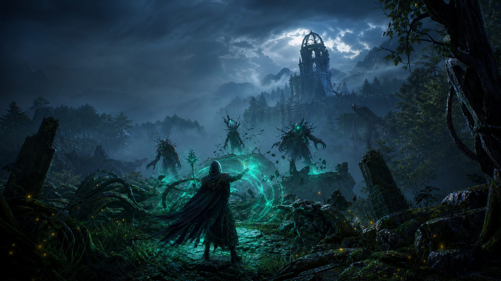

# Aetherwake

An original, dark-fantasy open-world action RPG built for four-player online co-op. Players discover and combine elemental spells to reshape the environment, hunt corrupted creatures, and restore a fractured magical wilderness.



## Vertical-slice promise

The first shippable slice is **The Veiled Reach**: a dense forest basin, ruined observatory, one world event, four learnable spells, three enemy archetypes, a co-op encounter, and persistent character progression. The architecture in this repository starts with deterministic gameplay rules and server-authoritative intent so the slice can grow into a multiplayer Steam release without a networking rewrite.

## Pillars

- **Magic changes the place:** burn brambles, freeze water, lift ruins, reveal hidden paths, and combine effects with other players.
- **Discovery earns power:** spells are learned through exploration, trials, and enemy knowledge—not a storefront.
- **Co-op is native:** host-authoritative sessions for up to four players, with inputs, spell casts, damage, and world-state changes validated by the host.
- **Grounded spectacle:** realistic material, weather, audio, animation, and lighting targets; readable combat always wins over visual noise.

## Current foundation

- Data-driven spell definitions and elemental interaction rules.
- A compact simulation proving cast validation, damage, XP, and learned-spell progression.
- Explicit replication contracts for player state, spell casts, and changed world props.
- Original AI-generated concept/key art stored only under `assets/ai-generated-assets/`.

## Build and run

This first milestone is dependency-free so design and gameplay rules compile everywhere. It runs a playable-systems simulation in the terminal.

```powershell
cmake -S . -B build
cmake --build build --config Release
.\build\Release\Aetherwake.exe
```

On single-config generators, run `./build/Aetherwake`.

## Controls target

| Input | Action |
| --- | --- |
| WASD / controller left stick | Move and explore |
| LMB / RT | Cast equipped spell |
| 1–4 / D-pad | Equip spell |
| E / X | Interact or learn spell |
| Q / LB | Elemental focus / combine window |

## Project map

- `src/game` — authoritative gameplay rules and progression.
- `src/net` — replication-facing data contracts; transport is intentionally replaceable.
- `assets/data` — editable spell and vertical-slice content definitions.
- `assets/ai-generated-assets` — clearly labeled generated visual source material.
- `docs` — technical, production, and Steam-release decisions.

See [the design brief](docs/GAME_DESIGN.md), [multiplayer architecture](docs/MULTIPLAYER.md), and [production plan](docs/PRODUCTION_PLAN.md).
